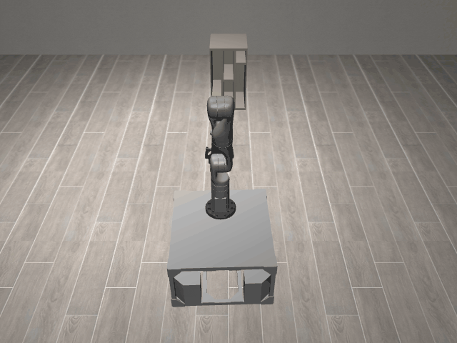
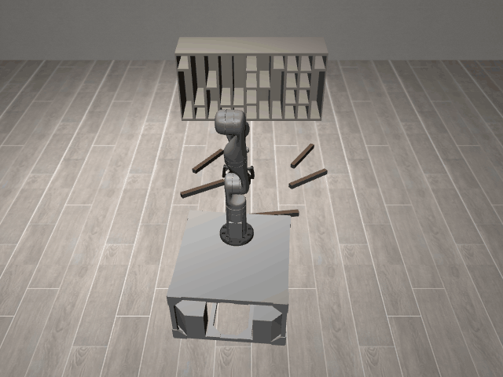

# ConstrainedCupboard3D

**Random Action Stats**: Total Reward: -25.00, Success: No, Steps: 25

## Description
A 3D task where the robot is supposed to fit multiple long rods into constrained spaces in a cupboard. The cupboard has varying numbers and sizes of rows and columns.

The robot has a holonomic mobile base with powered casters and a Kinova Gen3 arm.

The robot can control:
- Base pose (x, y, theta)
- Arm position (x, y, z)
- Arm orientation (quaternion)
- Gripper position (open/close)

## Available Variants
The variants require fitting different number of objects into cupboards of different sizes with varying arrangement of feasible regions at each reset.

- [`kinder/ConstrainedCupboard3D-o1-v0`](variants/ConstrainedCupboard3D/ConstrainedCupboard3D-o1.md) (o1)
- [`kinder/ConstrainedCupboard3D-o2-v0`](variants/ConstrainedCupboard3D/ConstrainedCupboard3D-o2.md) (o2)
- [`kinder/ConstrainedCupboard3D-o3-v0`](variants/ConstrainedCupboard3D/ConstrainedCupboard3D-o3.md) (o3)
- [`kinder/ConstrainedCupboard3D-o4-v0`](variants/ConstrainedCupboard3D/ConstrainedCupboard3D-o4.md) (o4)
- [`kinder/ConstrainedCupboard3D-o5-v0`](variants/ConstrainedCupboard3D/ConstrainedCupboard3D-o5.md) (o5)
- [`kinder/ConstrainedCupboard3D-o6-v0`](variants/ConstrainedCupboard3D/ConstrainedCupboard3D-o6.md) (o6)

## Initial State Distribution

## Example Demonstration

## Observation Space
*(Differs per variant, see individual variant pages)*

## Action Space
Actions: base pos and yaw (3), arm joints (7), gripper pos (1)

## Rewards
The primary reward is for successfully placing objects at their target locations.
- A reward of +1.0 is given for each object placed within a 5cm tolerance of its target.
- A smaller positive reward is given for objects within a 10cm tolerance to guide the robot.
- A small negative reward (-0.01) is applied at each timestep to encourage efficiency.
The episode terminates when all objects are placed at their respective targets.

## References
TidyBot++: An Open-Source Holonomic Mobile Manipulator for Robot Learning
- Jimmy Wu, William Chong, Robert Holmberg, Aaditya Prasad, Yihuai Gao,
  Oussama Khatib, Shuran Song, Szymon Rusinkiewicz, Jeannette Bohg
- Conference on Robot Learning (CoRL), 2024

https://github.com/tidybot2/tidybot2
