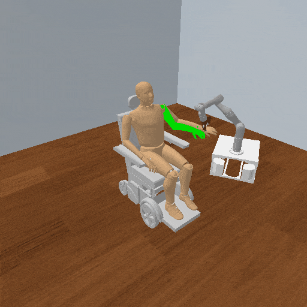
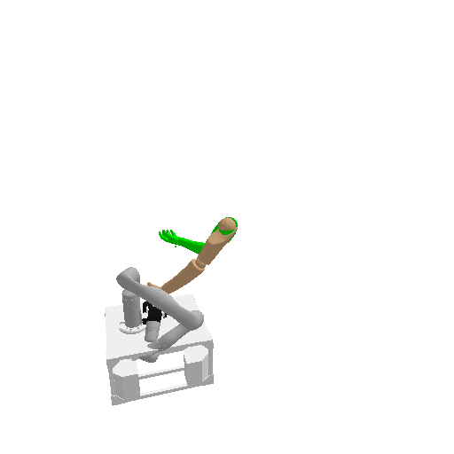

# LimbRepositioning3D

**Random Action Stats**: Total Reward: -1500.00, Success: No, Steps: 1500

## Description
A 3D task where the robot must reposition a passive human limb, as an assistive robot would when helping someone move an arm or a leg.

The robot's end effector is welded to the limb's grasp frame and drives the limb to a goal joint configuration with joint torques. The limb has no actuation of its own. The goal is drawn as a translucent green copy of the limb.

- Robot: a TidyBot Kinova Gen3 arm with 7 joints, on a base that stays put
- Simulation: PyBullet forward dynamics
- Gravity: off by default; set `gravity` in the config to enable it

On reset, each limb joint is perturbed within that limb's joint range around the variant's nominal starting configuration, and the draw is rejected if it pushes the limb into the scene, so the initial state varies with the seed while staying collision free. The robot re-solves its grasp for the sampled configuration.

## Available Variants
The variants pair a scene (`isolated`, `human`, `wheelchair`, `bed`) with a limb (`left-arm`, `right-arm`, `left-leg`, `right-leg`).

Each of the sixteen has its own robot placement, initial limb configuration, and goal.

- [`kinder/LimbRepositioning3D-isolated-left-arm-v0`](variants/LimbRepositioning3D/LimbRepositioning3D-isolated-left-arm.md) (isolated-left-arm)
- [`kinder/LimbRepositioning3D-isolated-right-arm-v0`](variants/LimbRepositioning3D/LimbRepositioning3D-isolated-right-arm.md) (isolated-right-arm)
- [`kinder/LimbRepositioning3D-isolated-left-leg-v0`](variants/LimbRepositioning3D/LimbRepositioning3D-isolated-left-leg.md) (isolated-left-leg)
- [`kinder/LimbRepositioning3D-isolated-right-leg-v0`](variants/LimbRepositioning3D/LimbRepositioning3D-isolated-right-leg.md) (isolated-right-leg)
- [`kinder/LimbRepositioning3D-human-left-arm-v0`](variants/LimbRepositioning3D/LimbRepositioning3D-human-left-arm.md) (human-left-arm)
- [`kinder/LimbRepositioning3D-human-right-arm-v0`](variants/LimbRepositioning3D/LimbRepositioning3D-human-right-arm.md) (human-right-arm)
- [`kinder/LimbRepositioning3D-human-left-leg-v0`](variants/LimbRepositioning3D/LimbRepositioning3D-human-left-leg.md) (human-left-leg)
- [`kinder/LimbRepositioning3D-human-right-leg-v0`](variants/LimbRepositioning3D/LimbRepositioning3D-human-right-leg.md) (human-right-leg)
- [`kinder/LimbRepositioning3D-wheelchair-left-arm-v0`](variants/LimbRepositioning3D/LimbRepositioning3D-wheelchair-left-arm.md) (wheelchair-left-arm)
- [`kinder/LimbRepositioning3D-wheelchair-right-arm-v0`](variants/LimbRepositioning3D/LimbRepositioning3D-wheelchair-right-arm.md) (wheelchair-right-arm)
- [`kinder/LimbRepositioning3D-wheelchair-left-leg-v0`](variants/LimbRepositioning3D/LimbRepositioning3D-wheelchair-left-leg.md) (wheelchair-left-leg)
- [`kinder/LimbRepositioning3D-wheelchair-right-leg-v0`](variants/LimbRepositioning3D/LimbRepositioning3D-wheelchair-right-leg.md) (wheelchair-right-leg)
- [`kinder/LimbRepositioning3D-bed-left-arm-v0`](variants/LimbRepositioning3D/LimbRepositioning3D-bed-left-arm.md) (bed-left-arm)
- [`kinder/LimbRepositioning3D-bed-right-arm-v0`](variants/LimbRepositioning3D/LimbRepositioning3D-bed-right-arm.md) (bed-right-arm)
- [`kinder/LimbRepositioning3D-bed-left-leg-v0`](variants/LimbRepositioning3D/LimbRepositioning3D-bed-left-leg.md) (bed-left-leg)
- [`kinder/LimbRepositioning3D-bed-right-leg-v0`](variants/LimbRepositioning3D/LimbRepositioning3D-bed-right-leg.md) (bed-right-leg)

## Initial State Distribution

## Example Demonstration
*(No demonstration GIFs available)*

## Observation Space
*(Differs per variant, see individual variant pages)*

## Action Space
An action space for a torque-controlled 7 DOF robot arm.

Actions are torques on each arm joint, clipped to the environment's torque limits. The base does not move, so it is not part of the action.

| **Index** | **Description** |
| --- | --- |
| 0 | torque applied to robot joint 1 |
| 1 | torque applied to robot joint 2 |
| 2 | torque applied to robot joint 3 |
| 3 | torque applied to robot joint 4 |
| 4 | torque applied to robot joint 5 |
| 5 | torque applied to robot joint 6 |
| 6 | torque applied to robot joint 7 |

## Rewards
A reward of -1 is given at every step until the goal is reached, so maximizing reward means repositioning the limb in as few steps as possible.

The episode terminates when the limb's joint configuration comes within `goal_atol` (0.1 radians by default) of the goal.

## References
Ported from the `limb-manipulation` repository, which the human limb models and the repositioning tasks are taken from.

https://github.com/empriselab/limb-manipulation

The Franka Panda used there is replaced here by TidyBot.
