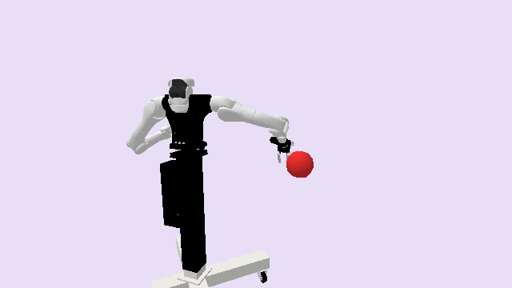

# VegaMotion3D

**Random Action Stats**: Total Reward: -25.00, Success: No, Steps: 25

## Description
A 3D environment where the goal is to reach a target sphere.

The robot is the right arm of a bimanual Dexmate Vega 1U, which has 7 degrees of freedom. Vega's remaining joints -- the other arm, the lift, the torso flip, the head, and both grippers -- are held at their home values, so this is a pure arm motion problem. The target is a sphere with radius 0.100m positioned randomly within the workspace bounds, rejecting positions the arm cannot reach.

The workspace bounds are:
- X: [0.3, 0.7]
- Y: [-0.7, -0.1]
- Z: [0.6, 1.1]

## Available Variants
This environment has only one variant.

- [`kinder/VegaMotion3D-v0`](variants/VegaMotion3D/VegaMotion3D.md) (v0)

## Initial State Distribution

## Example Demonstration
*(No demonstration GIFs available)*

## Observation Space
*(Differs per variant, see individual variant pages)*

## Action Space
An action space for an arm with 7 actuated joints.

Actions are bounded relative joint positions, in radians.

| **Index** | **Description** |
| --- | --- |
| 0 | delta joint 1 |
| 1 | delta joint 2 |
| 2 | delta joint 3 |
| 3 | delta joint 4 |
| 4 | delta joint 5 |
| 5 | delta joint 6 |
| 6 | delta joint 7 |

Deltas are clipped to the configured maximum magnitude and the resulting joint positions
are clipped to the robot's joint limits. A motion that would put the robot in
self-collision is rejected and the arm stays where it was.

## Rewards
The reward structure is simple:
- **-1.0** penalty at every timestep until the goal is reached
- **Termination** occurs when the end effector is within 0.100m of the target center

This encourages the robot to reach the target as quickly as possible while avoiding infinite episodes.

## References
This is a very common kind of environment. The robot is the [Dexmate Vega 1U](https://www.dexmate.ai/), modeled with [prpl_kinematics](https://github.com/Princeton-Robot-Planning-and-Learning/prpl-mono/tree/main/prpl-kinematics).
