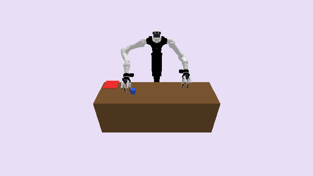

# VegaPickPlace3D

**Random Action Stats**: Total Reward: -25.00, Success: No, Steps: 25

## Description
A 3D environment where a cube on a table must be moved onto a target surface.

The robot is a bimanual Dexmate Vega 1U. Both 7-degree-of-freedom arms are actuated; the lift, the torso flip, the head, and both grippers are held at their home values. A cube rests on a table in front of the robot and a flat target patch marks a goal region elsewhere on the table. The episode ends when the cube rests on the table with its center inside the patch and neither arm is holding it.

Grasping is kinematic: an arm holds the cube whenever its grasp command is positive and its end effector is within 0.10m of the cube center. A held cube moves rigidly with the holding arm. The other arm can take the cube from the holder by requesting a grasp within range, so the cube can be passed between the arms. Releasing the cube sets it straight down onto the table (or the floor, if it is released away from the table), but only while the cube is at most 0.10m above its resting height; a release from higher up is ignored and the arm keeps hold, so a placement must be a deliberate set-down rather than a drop.

The cube and the target patch positions are sampled uniformly over the table, so depending on the episode the cube and the target may each be reachable by one arm or both. Some episodes are solvable with a single arm; others require carrying the cube to the middle and passing it between the arms.

## Available Variants
This environment has only one variant.

- [`kinder/VegaPickPlace3D-v0`](variants/VegaPickPlace3D/VegaPickPlace3D.md) (v0)

## Initial State Distribution

## Example Demonstration
*(No demonstration GIFs available)*

## Observation Space
*(Differs per variant, see individual variant pages)*

## Action Space
An action space for two arms with 7 actuated joints
each.

The first 14 entries are bounded relative joint positions, in radians.
The last two entries are grasp commands: above zero asks the arm to hold the cube,
at or below zero asks it to let go. A grasp only succeeds while the arm's end effector
is close to the cube.

| **Index** | **Description** |
| --- | --- |
| 0 | delta left joint 1 |
| 1 | delta left joint 2 |
| 2 | delta left joint 3 |
| 3 | delta left joint 4 |
| 4 | delta left joint 5 |
| 5 | delta left joint 6 |
| 6 | delta left joint 7 |
| 7 | delta right joint 1 |
| 8 | delta right joint 2 |
| 9 | delta right joint 3 |
| 10 | delta right joint 4 |
| 11 | delta right joint 5 |
| 12 | delta right joint 6 |
| 13 | delta right joint 7 |
| 14 | left grasp command |
| 15 | right grasp command |

Joint deltas are clipped to the configured maximum magnitude and the resulting joint
positions are clipped to the robot's joint limits. A motion that would put an arm in
collision is rejected and that arm stays where it was.

## Rewards
The reward structure is simple:
- **-1.0** penalty at every timestep until the goal is reached
- **Termination** occurs when the cube rests on the table with its center inside the target patch and neither arm is holding it

This encourages the robot to deliver the cube as quickly as possible while avoiding infinite episodes.

## References
Tabletop pick-and-place with an optional handover is a standard bimanual manipulation setting. The robot is the [Dexmate Vega 1U](https://www.dexmate.ai/), modeled with [prpl_kinematics](https://github.com/Princeton-Robot-Planning-and-Learning/prpl-mono/tree/main/prpl-kinematics).
