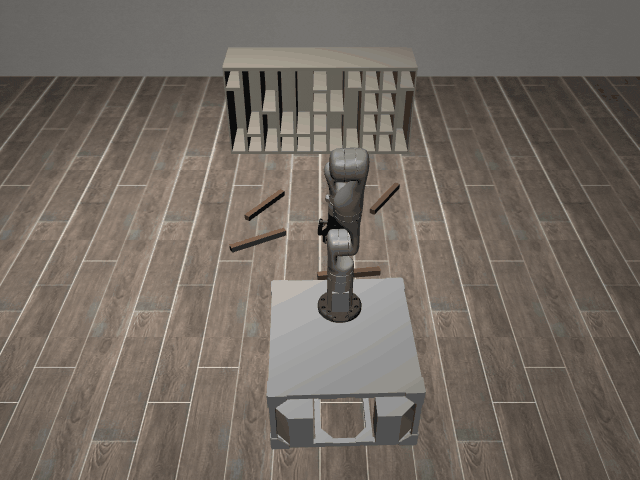

# ConstrainedCupboard3D-o5

## Usage
```python
import kinder
kinder.register_all_environments()
env = kinder.make("kinder/ConstrainedCupboard3D-o5-v0")
```

## Description
Place five rods onto open shelves across the wide eleven-cupboard fixture.

## Initial State Distribution


## Random Action Behavior


**Random Action Stats**: Total Reward: -25.00, Success: No, Steps: 25

## Example Demonstration
*(No demonstration GIFs available)*

## Observation Space
The entries of an array in this Box space correspond to the following object features:
| **Index** | **Object** | **Feature** |
| --- | --- | --- |
| 0 | cuboid_0 | x |
| 1 | cuboid_0 | y |
| 2 | cuboid_0 | z |
| 3 | cuboid_0 | qw |
| 4 | cuboid_0 | qx |
| 5 | cuboid_0 | qy |
| 6 | cuboid_0 | qz |
| 7 | cuboid_0 | vx |
| 8 | cuboid_0 | vy |
| 9 | cuboid_0 | vz |
| 10 | cuboid_0 | wx |
| 11 | cuboid_0 | wy |
| 12 | cuboid_0 | wz |
| 13 | cuboid_0 | bb_x |
| 14 | cuboid_0 | bb_y |
| 15 | cuboid_0 | bb_z |
| 16 | cuboid_1 | x |
| 17 | cuboid_1 | y |
| 18 | cuboid_1 | z |
| 19 | cuboid_1 | qw |
| 20 | cuboid_1 | qx |
| 21 | cuboid_1 | qy |
| 22 | cuboid_1 | qz |
| 23 | cuboid_1 | vx |
| 24 | cuboid_1 | vy |
| 25 | cuboid_1 | vz |
| 26 | cuboid_1 | wx |
| 27 | cuboid_1 | wy |
| 28 | cuboid_1 | wz |
| 29 | cuboid_1 | bb_x |
| 30 | cuboid_1 | bb_y |
| 31 | cuboid_1 | bb_z |
| 32 | cuboid_2 | x |
| 33 | cuboid_2 | y |
| 34 | cuboid_2 | z |
| 35 | cuboid_2 | qw |
| 36 | cuboid_2 | qx |
| 37 | cuboid_2 | qy |
| 38 | cuboid_2 | qz |
| 39 | cuboid_2 | vx |
| 40 | cuboid_2 | vy |
| 41 | cuboid_2 | vz |
| 42 | cuboid_2 | wx |
| 43 | cuboid_2 | wy |
| 44 | cuboid_2 | wz |
| 45 | cuboid_2 | bb_x |
| 46 | cuboid_2 | bb_y |
| 47 | cuboid_2 | bb_z |
| 48 | cuboid_3 | x |
| 49 | cuboid_3 | y |
| 50 | cuboid_3 | z |
| 51 | cuboid_3 | qw |
| 52 | cuboid_3 | qx |
| 53 | cuboid_3 | qy |
| 54 | cuboid_3 | qz |
| 55 | cuboid_3 | vx |
| 56 | cuboid_3 | vy |
| 57 | cuboid_3 | vz |
| 58 | cuboid_3 | wx |
| 59 | cuboid_3 | wy |
| 60 | cuboid_3 | wz |
| 61 | cuboid_3 | bb_x |
| 62 | cuboid_3 | bb_y |
| 63 | cuboid_3 | bb_z |
| 64 | cuboid_4 | x |
| 65 | cuboid_4 | y |
| 66 | cuboid_4 | z |
| 67 | cuboid_4 | qw |
| 68 | cuboid_4 | qx |
| 69 | cuboid_4 | qy |
| 70 | cuboid_4 | qz |
| 71 | cuboid_4 | vx |
| 72 | cuboid_4 | vy |
| 73 | cuboid_4 | vz |
| 74 | cuboid_4 | wx |
| 75 | cuboid_4 | wy |
| 76 | cuboid_4 | wz |
| 77 | cuboid_4 | bb_x |
| 78 | cuboid_4 | bb_y |
| 79 | cuboid_4 | bb_z |
| 80 | cupboard_0 | x |
| 81 | cupboard_0 | y |
| 82 | cupboard_0 | z |
| 83 | cupboard_0 | qw |
| 84 | cupboard_0 | qx |
| 85 | cupboard_0 | qy |
| 86 | cupboard_0 | qz |
| 87 | cupboard_1 | x |
| 88 | cupboard_1 | y |
| 89 | cupboard_1 | z |
| 90 | cupboard_1 | qw |
| 91 | cupboard_1 | qx |
| 92 | cupboard_1 | qy |
| 93 | cupboard_1 | qz |
| 94 | cupboard_10 | x |
| 95 | cupboard_10 | y |
| 96 | cupboard_10 | z |
| 97 | cupboard_10 | qw |
| 98 | cupboard_10 | qx |
| 99 | cupboard_10 | qy |
| 100 | cupboard_10 | qz |
| 101 | cupboard_2 | x |
| 102 | cupboard_2 | y |
| 103 | cupboard_2 | z |
| 104 | cupboard_2 | qw |
| 105 | cupboard_2 | qx |
| 106 | cupboard_2 | qy |
| 107 | cupboard_2 | qz |
| 108 | cupboard_3 | x |
| 109 | cupboard_3 | y |
| 110 | cupboard_3 | z |
| 111 | cupboard_3 | qw |
| 112 | cupboard_3 | qx |
| 113 | cupboard_3 | qy |
| 114 | cupboard_3 | qz |
| 115 | cupboard_4 | x |
| 116 | cupboard_4 | y |
| 117 | cupboard_4 | z |
| 118 | cupboard_4 | qw |
| 119 | cupboard_4 | qx |
| 120 | cupboard_4 | qy |
| 121 | cupboard_4 | qz |
| 122 | cupboard_5 | x |
| 123 | cupboard_5 | y |
| 124 | cupboard_5 | z |
| 125 | cupboard_5 | qw |
| 126 | cupboard_5 | qx |
| 127 | cupboard_5 | qy |
| 128 | cupboard_5 | qz |
| 129 | cupboard_6 | x |
| 130 | cupboard_6 | y |
| 131 | cupboard_6 | z |
| 132 | cupboard_6 | qw |
| 133 | cupboard_6 | qx |
| 134 | cupboard_6 | qy |
| 135 | cupboard_6 | qz |
| 136 | cupboard_7 | x |
| 137 | cupboard_7 | y |
| 138 | cupboard_7 | z |
| 139 | cupboard_7 | qw |
| 140 | cupboard_7 | qx |
| 141 | cupboard_7 | qy |
| 142 | cupboard_7 | qz |
| 143 | cupboard_8 | x |
| 144 | cupboard_8 | y |
| 145 | cupboard_8 | z |
| 146 | cupboard_8 | qw |
| 147 | cupboard_8 | qx |
| 148 | cupboard_8 | qy |
| 149 | cupboard_8 | qz |
| 150 | cupboard_9 | x |
| 151 | cupboard_9 | y |
| 152 | cupboard_9 | z |
| 153 | cupboard_9 | qw |
| 154 | cupboard_9 | qx |
| 155 | cupboard_9 | qy |
| 156 | cupboard_9 | qz |
| 157 | robot | pos_base_x |
| 158 | robot | pos_base_y |
| 159 | robot | pos_base_rot |
| 160 | robot | pos_arm_joint1 |
| 161 | robot | pos_arm_joint2 |
| 162 | robot | pos_arm_joint3 |
| 163 | robot | pos_arm_joint4 |
| 164 | robot | pos_arm_joint5 |
| 165 | robot | pos_arm_joint6 |
| 166 | robot | pos_arm_joint7 |
| 167 | robot | pos_gripper |
| 168 | robot | vel_base_x |
| 169 | robot | vel_base_y |
| 170 | robot | vel_base_rot |
| 171 | robot | vel_arm_joint1 |
| 172 | robot | vel_arm_joint2 |
| 173 | robot | vel_arm_joint3 |
| 174 | robot | vel_arm_joint4 |
| 175 | robot | vel_arm_joint5 |
| 176 | robot | vel_arm_joint6 |
| 177 | robot | vel_arm_joint7 |
| 178 | robot | vel_gripper |
