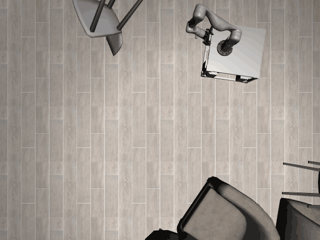

# Dynamo3D-o12

## Usage
```python
import kinder
env = kinder.make("kinder/Dynamo3D-o12-v0")
```

## Description
This variant uses the 'ground' scene type with 3 objects.

## Initial State Distribution


## Random Action Behavior


**Random Action Stats**: Total Reward: -0.25, Success: No, Steps: 25

## Example Demonstration
*(No demonstration GIFs available)*

## Observation Space
The entries of an array in this Box space correspond to the following object features:
| **Index** | **Object** | **Feature** |
| --- | --- | --- |
| 0 | obstacle_chair_1 | x |
| 1 | obstacle_chair_1 | y |
| 2 | obstacle_chair_1 | z |
| 3 | obstacle_chair_1 | qw |
| 4 | obstacle_chair_1 | qx |
| 5 | obstacle_chair_1 | qy |
| 6 | obstacle_chair_1 | qz |
| 7 | obstacle_chair_1 | vx |
| 8 | obstacle_chair_1 | vy |
| 9 | obstacle_chair_1 | vz |
| 10 | obstacle_chair_1 | wx |
| 11 | obstacle_chair_1 | wy |
| 12 | obstacle_chair_1 | wz |
| 13 | obstacle_chair_1 | bb_x |
| 14 | obstacle_chair_1 | bb_y |
| 15 | obstacle_chair_1 | bb_z |
| 16 | obstacle_chair_10 | x |
| 17 | obstacle_chair_10 | y |
| 18 | obstacle_chair_10 | z |
| 19 | obstacle_chair_10 | qw |
| 20 | obstacle_chair_10 | qx |
| 21 | obstacle_chair_10 | qy |
| 22 | obstacle_chair_10 | qz |
| 23 | obstacle_chair_10 | vx |
| 24 | obstacle_chair_10 | vy |
| 25 | obstacle_chair_10 | vz |
| 26 | obstacle_chair_10 | wx |
| 27 | obstacle_chair_10 | wy |
| 28 | obstacle_chair_10 | wz |
| 29 | obstacle_chair_10 | bb_x |
| 30 | obstacle_chair_10 | bb_y |
| 31 | obstacle_chair_10 | bb_z |
| 32 | obstacle_chair_11 | x |
| 33 | obstacle_chair_11 | y |
| 34 | obstacle_chair_11 | z |
| 35 | obstacle_chair_11 | qw |
| 36 | obstacle_chair_11 | qx |
| 37 | obstacle_chair_11 | qy |
| 38 | obstacle_chair_11 | qz |
| 39 | obstacle_chair_11 | vx |
| 40 | obstacle_chair_11 | vy |
| 41 | obstacle_chair_11 | vz |
| 42 | obstacle_chair_11 | wx |
| 43 | obstacle_chair_11 | wy |
| 44 | obstacle_chair_11 | wz |
| 45 | obstacle_chair_11 | bb_x |
| 46 | obstacle_chair_11 | bb_y |
| 47 | obstacle_chair_11 | bb_z |
| 48 | obstacle_chair_2 | x |
| 49 | obstacle_chair_2 | y |
| 50 | obstacle_chair_2 | z |
| 51 | obstacle_chair_2 | qw |
| 52 | obstacle_chair_2 | qx |
| 53 | obstacle_chair_2 | qy |
| 54 | obstacle_chair_2 | qz |
| 55 | obstacle_chair_2 | vx |
| 56 | obstacle_chair_2 | vy |
| 57 | obstacle_chair_2 | vz |
| 58 | obstacle_chair_2 | wx |
| 59 | obstacle_chair_2 | wy |
| 60 | obstacle_chair_2 | wz |
| 61 | obstacle_chair_2 | bb_x |
| 62 | obstacle_chair_2 | bb_y |
| 63 | obstacle_chair_2 | bb_z |
| 64 | obstacle_chair_3 | x |
| 65 | obstacle_chair_3 | y |
| 66 | obstacle_chair_3 | z |
| 67 | obstacle_chair_3 | qw |
| 68 | obstacle_chair_3 | qx |
| 69 | obstacle_chair_3 | qy |
| 70 | obstacle_chair_3 | qz |
| 71 | obstacle_chair_3 | vx |
| 72 | obstacle_chair_3 | vy |
| 73 | obstacle_chair_3 | vz |
| 74 | obstacle_chair_3 | wx |
| 75 | obstacle_chair_3 | wy |
| 76 | obstacle_chair_3 | wz |
| 77 | obstacle_chair_3 | bb_x |
| 78 | obstacle_chair_3 | bb_y |
| 79 | obstacle_chair_3 | bb_z |
| 80 | obstacle_chair_4 | x |
| 81 | obstacle_chair_4 | y |
| 82 | obstacle_chair_4 | z |
| 83 | obstacle_chair_4 | qw |
| 84 | obstacle_chair_4 | qx |
| 85 | obstacle_chair_4 | qy |
| 86 | obstacle_chair_4 | qz |
| 87 | obstacle_chair_4 | vx |
| 88 | obstacle_chair_4 | vy |
| 89 | obstacle_chair_4 | vz |
| 90 | obstacle_chair_4 | wx |
| 91 | obstacle_chair_4 | wy |
| 92 | obstacle_chair_4 | wz |
| 93 | obstacle_chair_4 | bb_x |
| 94 | obstacle_chair_4 | bb_y |
| 95 | obstacle_chair_4 | bb_z |
| 96 | obstacle_chair_5 | x |
| 97 | obstacle_chair_5 | y |
| 98 | obstacle_chair_5 | z |
| 99 | obstacle_chair_5 | qw |
| 100 | obstacle_chair_5 | qx |
| 101 | obstacle_chair_5 | qy |
| 102 | obstacle_chair_5 | qz |
| 103 | obstacle_chair_5 | vx |
| 104 | obstacle_chair_5 | vy |
| 105 | obstacle_chair_5 | vz |
| 106 | obstacle_chair_5 | wx |
| 107 | obstacle_chair_5 | wy |
| 108 | obstacle_chair_5 | wz |
| 109 | obstacle_chair_5 | bb_x |
| 110 | obstacle_chair_5 | bb_y |
| 111 | obstacle_chair_5 | bb_z |
| 112 | obstacle_chair_6 | x |
| 113 | obstacle_chair_6 | y |
| 114 | obstacle_chair_6 | z |
| 115 | obstacle_chair_6 | qw |
| 116 | obstacle_chair_6 | qx |
| 117 | obstacle_chair_6 | qy |
| 118 | obstacle_chair_6 | qz |
| 119 | obstacle_chair_6 | vx |
| 120 | obstacle_chair_6 | vy |
| 121 | obstacle_chair_6 | vz |
| 122 | obstacle_chair_6 | wx |
| 123 | obstacle_chair_6 | wy |
| 124 | obstacle_chair_6 | wz |
| 125 | obstacle_chair_6 | bb_x |
| 126 | obstacle_chair_6 | bb_y |
| 127 | obstacle_chair_6 | bb_z |
| 128 | obstacle_chair_7 | x |
| 129 | obstacle_chair_7 | y |
| 130 | obstacle_chair_7 | z |
| 131 | obstacle_chair_7 | qw |
| 132 | obstacle_chair_7 | qx |
| 133 | obstacle_chair_7 | qy |
| 134 | obstacle_chair_7 | qz |
| 135 | obstacle_chair_7 | vx |
| 136 | obstacle_chair_7 | vy |
| 137 | obstacle_chair_7 | vz |
| 138 | obstacle_chair_7 | wx |
| 139 | obstacle_chair_7 | wy |
| 140 | obstacle_chair_7 | wz |
| 141 | obstacle_chair_7 | bb_x |
| 142 | obstacle_chair_7 | bb_y |
| 143 | obstacle_chair_7 | bb_z |
| 144 | obstacle_chair_8 | x |
| 145 | obstacle_chair_8 | y |
| 146 | obstacle_chair_8 | z |
| 147 | obstacle_chair_8 | qw |
| 148 | obstacle_chair_8 | qx |
| 149 | obstacle_chair_8 | qy |
| 150 | obstacle_chair_8 | qz |
| 151 | obstacle_chair_8 | vx |
| 152 | obstacle_chair_8 | vy |
| 153 | obstacle_chair_8 | vz |
| 154 | obstacle_chair_8 | wx |
| 155 | obstacle_chair_8 | wy |
| 156 | obstacle_chair_8 | wz |
| 157 | obstacle_chair_8 | bb_x |
| 158 | obstacle_chair_8 | bb_y |
| 159 | obstacle_chair_8 | bb_z |
| 160 | obstacle_chair_9 | x |
| 161 | obstacle_chair_9 | y |
| 162 | obstacle_chair_9 | z |
| 163 | obstacle_chair_9 | qw |
| 164 | obstacle_chair_9 | qx |
| 165 | obstacle_chair_9 | qy |
| 166 | obstacle_chair_9 | qz |
| 167 | obstacle_chair_9 | vx |
| 168 | obstacle_chair_9 | vy |
| 169 | obstacle_chair_9 | vz |
| 170 | obstacle_chair_9 | wx |
| 171 | obstacle_chair_9 | wy |
| 172 | obstacle_chair_9 | wz |
| 173 | obstacle_chair_9 | bb_x |
| 174 | obstacle_chair_9 | bb_y |
| 175 | obstacle_chair_9 | bb_z |
| 176 | robot | pos_base_x |
| 177 | robot | pos_base_y |
| 178 | robot | pos_base_rot |
| 179 | robot | pos_arm_joint1 |
| 180 | robot | pos_arm_joint2 |
| 181 | robot | pos_arm_joint3 |
| 182 | robot | pos_arm_joint4 |
| 183 | robot | pos_arm_joint5 |
| 184 | robot | pos_arm_joint6 |
| 185 | robot | pos_arm_joint7 |
| 186 | robot | pos_gripper |
| 187 | robot | vel_base_x |
| 188 | robot | vel_base_y |
| 189 | robot | vel_base_rot |
| 190 | robot | vel_arm_joint1 |
| 191 | robot | vel_arm_joint2 |
| 192 | robot | vel_arm_joint3 |
| 193 | robot | vel_arm_joint4 |
| 194 | robot | vel_arm_joint5 |
| 195 | robot | vel_arm_joint6 |
| 196 | robot | vel_arm_joint7 |
| 197 | robot | vel_gripper |
