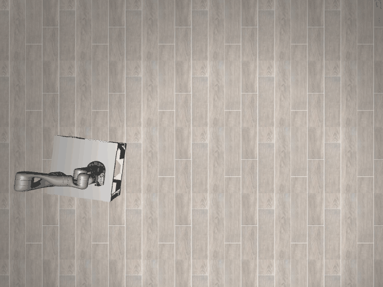
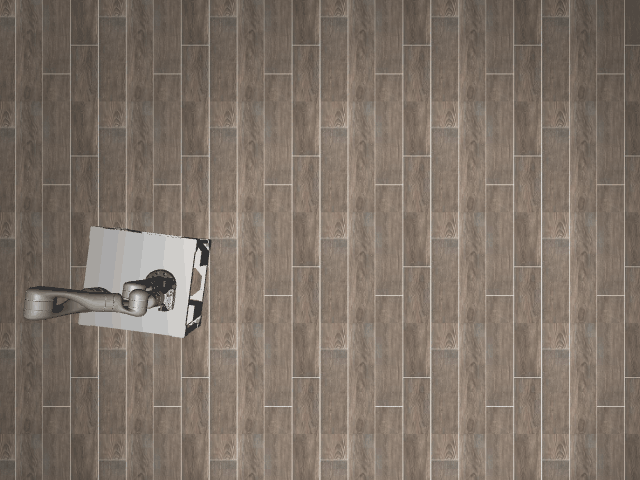

# Dynamo3D-o3

## Usage
```python
import kinder
kinder.register_all_environments()
env = kinder.make("kinder/Dynamo3D-o3-v0")
```

## Description
This variant uses the 'ground' scene type with 3 objects.

## Initial State Distribution


## Random Action Behavior


**Random Action Stats**: Total Reward: -25.00, Success: No, Steps: 25

## Example Demonstration
*(No demonstration GIFs available)*

## Observation Space
The entries of an array in this Box space correspond to the following object features:
| **Index** | **Object** | **Feature** |
| --- | --- | --- |
| 0 | obstacle_chair_1 | x |
| 1 | obstacle_chair_1 | y |
| 2 | obstacle_chair_1 | z |
| 3 | obstacle_chair_1 | qw |
| 4 | obstacle_chair_1 | qx |
| 5 | obstacle_chair_1 | qy |
| 6 | obstacle_chair_1 | qz |
| 7 | obstacle_chair_1 | vx |
| 8 | obstacle_chair_1 | vy |
| 9 | obstacle_chair_1 | vz |
| 10 | obstacle_chair_1 | wx |
| 11 | obstacle_chair_1 | wy |
| 12 | obstacle_chair_1 | wz |
| 13 | obstacle_chair_1 | bb_x |
| 14 | obstacle_chair_1 | bb_y |
| 15 | obstacle_chair_1 | bb_z |
| 16 | obstacle_chair_2 | x |
| 17 | obstacle_chair_2 | y |
| 18 | obstacle_chair_2 | z |
| 19 | obstacle_chair_2 | qw |
| 20 | obstacle_chair_2 | qx |
| 21 | obstacle_chair_2 | qy |
| 22 | obstacle_chair_2 | qz |
| 23 | obstacle_chair_2 | vx |
| 24 | obstacle_chair_2 | vy |
| 25 | obstacle_chair_2 | vz |
| 26 | obstacle_chair_2 | wx |
| 27 | obstacle_chair_2 | wy |
| 28 | obstacle_chair_2 | wz |
| 29 | obstacle_chair_2 | bb_x |
| 30 | obstacle_chair_2 | bb_y |
| 31 | obstacle_chair_2 | bb_z |
| 32 | obstacle_chair_3 | x |
| 33 | obstacle_chair_3 | y |
| 34 | obstacle_chair_3 | z |
| 35 | obstacle_chair_3 | qw |
| 36 | obstacle_chair_3 | qx |
| 37 | obstacle_chair_3 | qy |
| 38 | obstacle_chair_3 | qz |
| 39 | obstacle_chair_3 | vx |
| 40 | obstacle_chair_3 | vy |
| 41 | obstacle_chair_3 | vz |
| 42 | obstacle_chair_3 | wx |
| 43 | obstacle_chair_3 | wy |
| 44 | obstacle_chair_3 | wz |
| 45 | obstacle_chair_3 | bb_x |
| 46 | obstacle_chair_3 | bb_y |
| 47 | obstacle_chair_3 | bb_z |
| 48 | robot | pos_base_x |
| 49 | robot | pos_base_y |
| 50 | robot | pos_base_rot |
| 51 | robot | pos_arm_joint1 |
| 52 | robot | pos_arm_joint2 |
| 53 | robot | pos_arm_joint3 |
| 54 | robot | pos_arm_joint4 |
| 55 | robot | pos_arm_joint5 |
| 56 | robot | pos_arm_joint6 |
| 57 | robot | pos_arm_joint7 |
| 58 | robot | pos_gripper |
| 59 | robot | vel_base_x |
| 60 | robot | vel_base_y |
| 61 | robot | vel_base_rot |
| 62 | robot | vel_arm_joint1 |
| 63 | robot | vel_arm_joint2 |
| 64 | robot | vel_arm_joint3 |
| 65 | robot | vel_arm_joint4 |
| 66 | robot | vel_arm_joint5 |
| 67 | robot | vel_arm_joint6 |
| 68 | robot | vel_arm_joint7 |
| 69 | robot | vel_gripper |
