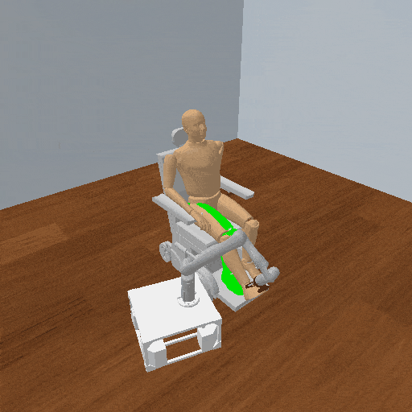

# LimbRepositioning3D-wheelchair-right-leg

## Usage
```python
import kinder
kinder.register_all_environments()
env = kinder.make("kinder/LimbRepositioning3D-wheelchair-right-leg-v0")
```

## Description
Reposition the right leg of a human seated in a wheelchair.

## Initial State Distribution


## Random Action Behavior


**Random Action Stats**: Total Reward: -1500.00, Success: No, Steps: 1500

## Example Demonstration
*(No demonstration GIFs available)*

## Observation Space
The entries of an array in this Box space correspond to the following object features:
| **Index** | **Object** | **Feature** |
| --- | --- | --- |
| 0 | robot | pos_base_x |
| 1 | robot | pos_base_y |
| 2 | robot | pos_base_rot |
| 3 | robot | joint_1 |
| 4 | robot | joint_2 |
| 5 | robot | joint_3 |
| 6 | robot | joint_4 |
| 7 | robot | joint_5 |
| 8 | robot | joint_6 |
| 9 | robot | joint_7 |
| 10 | robot | joint_vel_1 |
| 11 | robot | joint_vel_2 |
| 12 | robot | joint_vel_3 |
| 13 | robot | joint_vel_4 |
| 14 | robot | joint_vel_5 |
| 15 | robot | joint_vel_6 |
| 16 | robot | joint_vel_7 |
| 17 | limb | joint_1 |
| 18 | limb | joint_2 |
| 19 | limb | joint_3 |
| 20 | limb | joint_4 |
| 21 | limb | joint_5 |
| 22 | limb | joint_6 |
| 23 | limb | joint_vel_1 |
| 24 | limb | joint_vel_2 |
| 25 | limb | joint_vel_3 |
| 26 | limb | joint_vel_4 |
| 27 | limb | joint_vel_5 |
| 28 | limb | joint_vel_6 |
| 29 | limb | goal_joint_1 |
| 30 | limb | goal_joint_2 |
| 31 | limb | goal_joint_3 |
| 32 | limb | goal_joint_4 |
| 33 | limb | goal_joint_5 |
| 34 | limb | goal_joint_6 |
| 35 | fixture | pose_x |
| 36 | fixture | pose_y |
| 37 | fixture | pose_z |
| 38 | fixture | pose_qx |
| 39 | fixture | pose_qy |
| 40 | fixture | pose_qz |
| 41 | fixture | pose_qw |
