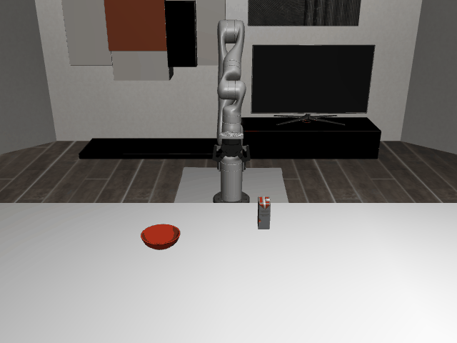
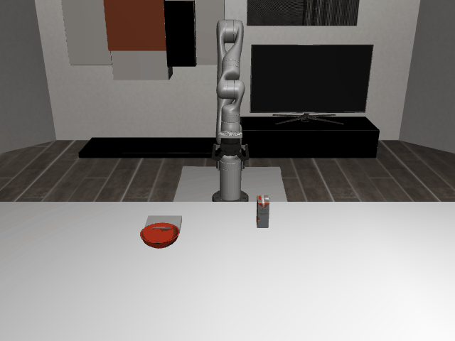

# Rearrange3D-o1-put_the_boxed_drink_behind_the_bowl

## Usage
```python
import kinder
kinder.register_all_environments()
env = kinder.make("kinder/Rearrange3D-o1-put_the_boxed_drink_behind_the_bowl-v0")
```

## Description
Place the boxed drink behind the bowl on the kitchen counter.

## Initial State Distribution


## Random Action Behavior


**Random Action Stats**: Total Reward: -25.00, Success: No, Steps: 25

## Example Demonstration
*(No demonstration GIFs available)*

## Observation Space
The entries of an array in this Box space correspond to the following object features:
| **Index** | **Object** | **Feature** |
| --- | --- | --- |
| 0 | bowl_0 | x |
| 1 | bowl_0 | y |
| 2 | bowl_0 | z |
| 3 | bowl_0 | qw |
| 4 | bowl_0 | qx |
| 5 | bowl_0 | qy |
| 6 | bowl_0 | qz |
| 7 | bowl_0 | vx |
| 8 | bowl_0 | vy |
| 9 | bowl_0 | vz |
| 10 | bowl_0 | wx |
| 11 | bowl_0 | wy |
| 12 | bowl_0 | wz |
| 13 | bowl_0 | bb_x |
| 14 | bowl_0 | bb_y |
| 15 | bowl_0 | bb_z |
| 16 | boxed_drink_0 | x |
| 17 | boxed_drink_0 | y |
| 18 | boxed_drink_0 | z |
| 19 | boxed_drink_0 | qw |
| 20 | boxed_drink_0 | qx |
| 21 | boxed_drink_0 | qy |
| 22 | boxed_drink_0 | qz |
| 23 | boxed_drink_0 | vx |
| 24 | boxed_drink_0 | vy |
| 25 | boxed_drink_0 | vz |
| 26 | boxed_drink_0 | wx |
| 27 | boxed_drink_0 | wy |
| 28 | boxed_drink_0 | wz |
| 29 | boxed_drink_0 | bb_x |
| 30 | boxed_drink_0 | bb_y |
| 31 | boxed_drink_0 | bb_z |
| 32 | kitchen_cooking_area | x |
| 33 | kitchen_cooking_area | y |
| 34 | kitchen_cooking_area | z |
| 35 | kitchen_cooking_area | qw |
| 36 | kitchen_cooking_area | qx |
| 37 | kitchen_cooking_area | qy |
| 38 | kitchen_cooking_area | qz |
| 39 | kitchen_cooking_area_drawer_s0c1 | pos |
| 40 | kitchen_cooking_area_drawer_s1c1 | pos |
| 41 | kitchen_cooking_area_upper | x |
| 42 | kitchen_cooking_area_upper | y |
| 43 | kitchen_cooking_area_upper | z |
| 44 | kitchen_cooking_area_upper | qw |
| 45 | kitchen_cooking_area_upper | qx |
| 46 | kitchen_cooking_area_upper | qy |
| 47 | kitchen_cooking_area_upper | qz |
| 48 | kitchen_island | x |
| 49 | kitchen_island | y |
| 50 | kitchen_island | z |
| 51 | kitchen_island | qw |
| 52 | kitchen_island | qx |
| 53 | kitchen_island | qy |
| 54 | kitchen_island | qz |
| 55 | kitchen_island_drawer_s0c0 | pos |
| 56 | kitchen_island_drawer_s0c1 | pos |
| 57 | kitchen_island_drawer_s0c2 | pos |
| 58 | kitchen_island_drawer_s1c0 | pos |
| 59 | kitchen_island_drawer_s1c1 | pos |
| 60 | kitchen_island_drawer_s1c2 | pos |
| 61 | kitchen_left_corner | x |
| 62 | kitchen_left_corner | y |
| 63 | kitchen_left_corner | z |
| 64 | kitchen_left_corner | qw |
| 65 | kitchen_left_corner | qx |
| 66 | kitchen_left_corner | qy |
| 67 | kitchen_left_corner | qz |
| 68 | kitchen_left_side | x |
| 69 | kitchen_left_side | y |
| 70 | kitchen_left_side | z |
| 71 | kitchen_left_side | qw |
| 72 | kitchen_left_side | qx |
| 73 | kitchen_left_side | qy |
| 74 | kitchen_left_side | qz |
| 75 | kitchen_left_side_drawer_s0c1 | pos |
| 76 | kitchen_left_side_drawer_s1c1 | pos |
| 77 | robot | pos_base_x |
| 78 | robot | pos_base_y |
| 79 | robot | pos_base_rot |
| 80 | robot | pos_arm_joint1 |
| 81 | robot | pos_arm_joint2 |
| 82 | robot | pos_arm_joint3 |
| 83 | robot | pos_arm_joint4 |
| 84 | robot | pos_arm_joint5 |
| 85 | robot | pos_arm_joint6 |
| 86 | robot | pos_arm_joint7 |
| 87 | robot | pos_gripper |
| 88 | robot | vel_base_x |
| 89 | robot | vel_base_y |
| 90 | robot | vel_base_rot |
| 91 | robot | vel_arm_joint1 |
| 92 | robot | vel_arm_joint2 |
| 93 | robot | vel_arm_joint3 |
| 94 | robot | vel_arm_joint4 |
| 95 | robot | vel_arm_joint5 |
| 96 | robot | vel_arm_joint6 |
| 97 | robot | vel_arm_joint7 |
| 98 | robot | vel_gripper |
