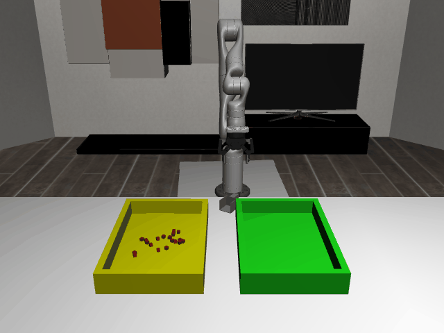

# ScoopPour3D-o20

## Usage
```python
import kinder
kinder.register_all_environments()
env = kinder.make("kinder/ScoopPour3D-o20-v0")
```

## Description
Transfer 20 cubes from a source bin to a target bin on the kitchen island.

## Initial State Distribution


## Random Action Behavior


**Random Action Stats**: Total Reward: -25.00, Success: No, Steps: 25

## Example Demonstration
*(No demonstration GIFs available)*

## Observation Space
The entries of an array in this Box space correspond to the following object features:
| **Index** | **Object** | **Feature** |
| --- | --- | --- |
| 0 | bin_green_0 | x |
| 1 | bin_green_0 | y |
| 2 | bin_green_0 | z |
| 3 | bin_green_0 | qw |
| 4 | bin_green_0 | qx |
| 5 | bin_green_0 | qy |
| 6 | bin_green_0 | qz |
| 7 | bin_green_0 | vx |
| 8 | bin_green_0 | vy |
| 9 | bin_green_0 | vz |
| 10 | bin_green_0 | wx |
| 11 | bin_green_0 | wy |
| 12 | bin_green_0 | wz |
| 13 | bin_green_0 | bb_x |
| 14 | bin_green_0 | bb_y |
| 15 | bin_green_0 | bb_z |
| 16 | bin_yellow_0 | x |
| 17 | bin_yellow_0 | y |
| 18 | bin_yellow_0 | z |
| 19 | bin_yellow_0 | qw |
| 20 | bin_yellow_0 | qx |
| 21 | bin_yellow_0 | qy |
| 22 | bin_yellow_0 | qz |
| 23 | bin_yellow_0 | vx |
| 24 | bin_yellow_0 | vy |
| 25 | bin_yellow_0 | vz |
| 26 | bin_yellow_0 | wx |
| 27 | bin_yellow_0 | wy |
| 28 | bin_yellow_0 | wz |
| 29 | bin_yellow_0 | bb_x |
| 30 | bin_yellow_0 | bb_y |
| 31 | bin_yellow_0 | bb_z |
| 32 | cube_0 | x |
| 33 | cube_0 | y |
| 34 | cube_0 | z |
| 35 | cube_0 | qw |
| 36 | cube_0 | qx |
| 37 | cube_0 | qy |
| 38 | cube_0 | qz |
| 39 | cube_0 | vx |
| 40 | cube_0 | vy |
| 41 | cube_0 | vz |
| 42 | cube_0 | wx |
| 43 | cube_0 | wy |
| 44 | cube_0 | wz |
| 45 | cube_0 | bb_x |
| 46 | cube_0 | bb_y |
| 47 | cube_0 | bb_z |
| 48 | cube_1 | x |
| 49 | cube_1 | y |
| 50 | cube_1 | z |
| 51 | cube_1 | qw |
| 52 | cube_1 | qx |
| 53 | cube_1 | qy |
| 54 | cube_1 | qz |
| 55 | cube_1 | vx |
| 56 | cube_1 | vy |
| 57 | cube_1 | vz |
| 58 | cube_1 | wx |
| 59 | cube_1 | wy |
| 60 | cube_1 | wz |
| 61 | cube_1 | bb_x |
| 62 | cube_1 | bb_y |
| 63 | cube_1 | bb_z |
| 64 | cube_10 | x |
| 65 | cube_10 | y |
| 66 | cube_10 | z |
| 67 | cube_10 | qw |
| 68 | cube_10 | qx |
| 69 | cube_10 | qy |
| 70 | cube_10 | qz |
| 71 | cube_10 | vx |
| 72 | cube_10 | vy |
| 73 | cube_10 | vz |
| 74 | cube_10 | wx |
| 75 | cube_10 | wy |
| 76 | cube_10 | wz |
| 77 | cube_10 | bb_x |
| 78 | cube_10 | bb_y |
| 79 | cube_10 | bb_z |
| 80 | cube_11 | x |
| 81 | cube_11 | y |
| 82 | cube_11 | z |
| 83 | cube_11 | qw |
| 84 | cube_11 | qx |
| 85 | cube_11 | qy |
| 86 | cube_11 | qz |
| 87 | cube_11 | vx |
| 88 | cube_11 | vy |
| 89 | cube_11 | vz |
| 90 | cube_11 | wx |
| 91 | cube_11 | wy |
| 92 | cube_11 | wz |
| 93 | cube_11 | bb_x |
| 94 | cube_11 | bb_y |
| 95 | cube_11 | bb_z |
| 96 | cube_12 | x |
| 97 | cube_12 | y |
| 98 | cube_12 | z |
| 99 | cube_12 | qw |
| 100 | cube_12 | qx |
| 101 | cube_12 | qy |
| 102 | cube_12 | qz |
| 103 | cube_12 | vx |
| 104 | cube_12 | vy |
| 105 | cube_12 | vz |
| 106 | cube_12 | wx |
| 107 | cube_12 | wy |
| 108 | cube_12 | wz |
| 109 | cube_12 | bb_x |
| 110 | cube_12 | bb_y |
| 111 | cube_12 | bb_z |
| 112 | cube_13 | x |
| 113 | cube_13 | y |
| 114 | cube_13 | z |
| 115 | cube_13 | qw |
| 116 | cube_13 | qx |
| 117 | cube_13 | qy |
| 118 | cube_13 | qz |
| 119 | cube_13 | vx |
| 120 | cube_13 | vy |
| 121 | cube_13 | vz |
| 122 | cube_13 | wx |
| 123 | cube_13 | wy |
| 124 | cube_13 | wz |
| 125 | cube_13 | bb_x |
| 126 | cube_13 | bb_y |
| 127 | cube_13 | bb_z |
| 128 | cube_14 | x |
| 129 | cube_14 | y |
| 130 | cube_14 | z |
| 131 | cube_14 | qw |
| 132 | cube_14 | qx |
| 133 | cube_14 | qy |
| 134 | cube_14 | qz |
| 135 | cube_14 | vx |
| 136 | cube_14 | vy |
| 137 | cube_14 | vz |
| 138 | cube_14 | wx |
| 139 | cube_14 | wy |
| 140 | cube_14 | wz |
| 141 | cube_14 | bb_x |
| 142 | cube_14 | bb_y |
| 143 | cube_14 | bb_z |
| 144 | cube_15 | x |
| 145 | cube_15 | y |
| 146 | cube_15 | z |
| 147 | cube_15 | qw |
| 148 | cube_15 | qx |
| 149 | cube_15 | qy |
| 150 | cube_15 | qz |
| 151 | cube_15 | vx |
| 152 | cube_15 | vy |
| 153 | cube_15 | vz |
| 154 | cube_15 | wx |
| 155 | cube_15 | wy |
| 156 | cube_15 | wz |
| 157 | cube_15 | bb_x |
| 158 | cube_15 | bb_y |
| 159 | cube_15 | bb_z |
| 160 | cube_16 | x |
| 161 | cube_16 | y |
| 162 | cube_16 | z |
| 163 | cube_16 | qw |
| 164 | cube_16 | qx |
| 165 | cube_16 | qy |
| 166 | cube_16 | qz |
| 167 | cube_16 | vx |
| 168 | cube_16 | vy |
| 169 | cube_16 | vz |
| 170 | cube_16 | wx |
| 171 | cube_16 | wy |
| 172 | cube_16 | wz |
| 173 | cube_16 | bb_x |
| 174 | cube_16 | bb_y |
| 175 | cube_16 | bb_z |
| 176 | cube_17 | x |
| 177 | cube_17 | y |
| 178 | cube_17 | z |
| 179 | cube_17 | qw |
| 180 | cube_17 | qx |
| 181 | cube_17 | qy |
| 182 | cube_17 | qz |
| 183 | cube_17 | vx |
| 184 | cube_17 | vy |
| 185 | cube_17 | vz |
| 186 | cube_17 | wx |
| 187 | cube_17 | wy |
| 188 | cube_17 | wz |
| 189 | cube_17 | bb_x |
| 190 | cube_17 | bb_y |
| 191 | cube_17 | bb_z |
| 192 | cube_18 | x |
| 193 | cube_18 | y |
| 194 | cube_18 | z |
| 195 | cube_18 | qw |
| 196 | cube_18 | qx |
| 197 | cube_18 | qy |
| 198 | cube_18 | qz |
| 199 | cube_18 | vx |
| 200 | cube_18 | vy |
| 201 | cube_18 | vz |
| 202 | cube_18 | wx |
| 203 | cube_18 | wy |
| 204 | cube_18 | wz |
| 205 | cube_18 | bb_x |
| 206 | cube_18 | bb_y |
| 207 | cube_18 | bb_z |
| 208 | cube_19 | x |
| 209 | cube_19 | y |
| 210 | cube_19 | z |
| 211 | cube_19 | qw |
| 212 | cube_19 | qx |
| 213 | cube_19 | qy |
| 214 | cube_19 | qz |
| 215 | cube_19 | vx |
| 216 | cube_19 | vy |
| 217 | cube_19 | vz |
| 218 | cube_19 | wx |
| 219 | cube_19 | wy |
| 220 | cube_19 | wz |
| 221 | cube_19 | bb_x |
| 222 | cube_19 | bb_y |
| 223 | cube_19 | bb_z |
| 224 | cube_2 | x |
| 225 | cube_2 | y |
| 226 | cube_2 | z |
| 227 | cube_2 | qw |
| 228 | cube_2 | qx |
| 229 | cube_2 | qy |
| 230 | cube_2 | qz |
| 231 | cube_2 | vx |
| 232 | cube_2 | vy |
| 233 | cube_2 | vz |
| 234 | cube_2 | wx |
| 235 | cube_2 | wy |
| 236 | cube_2 | wz |
| 237 | cube_2 | bb_x |
| 238 | cube_2 | bb_y |
| 239 | cube_2 | bb_z |
| 240 | cube_3 | x |
| 241 | cube_3 | y |
| 242 | cube_3 | z |
| 243 | cube_3 | qw |
| 244 | cube_3 | qx |
| 245 | cube_3 | qy |
| 246 | cube_3 | qz |
| 247 | cube_3 | vx |
| 248 | cube_3 | vy |
| 249 | cube_3 | vz |
| 250 | cube_3 | wx |
| 251 | cube_3 | wy |
| 252 | cube_3 | wz |
| 253 | cube_3 | bb_x |
| 254 | cube_3 | bb_y |
| 255 | cube_3 | bb_z |
| 256 | cube_4 | x |
| 257 | cube_4 | y |
| 258 | cube_4 | z |
| 259 | cube_4 | qw |
| 260 | cube_4 | qx |
| 261 | cube_4 | qy |
| 262 | cube_4 | qz |
| 263 | cube_4 | vx |
| 264 | cube_4 | vy |
| 265 | cube_4 | vz |
| 266 | cube_4 | wx |
| 267 | cube_4 | wy |
| 268 | cube_4 | wz |
| 269 | cube_4 | bb_x |
| 270 | cube_4 | bb_y |
| 271 | cube_4 | bb_z |
| 272 | cube_5 | x |
| 273 | cube_5 | y |
| 274 | cube_5 | z |
| 275 | cube_5 | qw |
| 276 | cube_5 | qx |
| 277 | cube_5 | qy |
| 278 | cube_5 | qz |
| 279 | cube_5 | vx |
| 280 | cube_5 | vy |
| 281 | cube_5 | vz |
| 282 | cube_5 | wx |
| 283 | cube_5 | wy |
| 284 | cube_5 | wz |
| 285 | cube_5 | bb_x |
| 286 | cube_5 | bb_y |
| 287 | cube_5 | bb_z |
| 288 | cube_6 | x |
| 289 | cube_6 | y |
| 290 | cube_6 | z |
| 291 | cube_6 | qw |
| 292 | cube_6 | qx |
| 293 | cube_6 | qy |
| 294 | cube_6 | qz |
| 295 | cube_6 | vx |
| 296 | cube_6 | vy |
| 297 | cube_6 | vz |
| 298 | cube_6 | wx |
| 299 | cube_6 | wy |
| 300 | cube_6 | wz |
| 301 | cube_6 | bb_x |
| 302 | cube_6 | bb_y |
| 303 | cube_6 | bb_z |
| 304 | cube_7 | x |
| 305 | cube_7 | y |
| 306 | cube_7 | z |
| 307 | cube_7 | qw |
| 308 | cube_7 | qx |
| 309 | cube_7 | qy |
| 310 | cube_7 | qz |
| 311 | cube_7 | vx |
| 312 | cube_7 | vy |
| 313 | cube_7 | vz |
| 314 | cube_7 | wx |
| 315 | cube_7 | wy |
| 316 | cube_7 | wz |
| 317 | cube_7 | bb_x |
| 318 | cube_7 | bb_y |
| 319 | cube_7 | bb_z |
| 320 | cube_8 | x |
| 321 | cube_8 | y |
| 322 | cube_8 | z |
| 323 | cube_8 | qw |
| 324 | cube_8 | qx |
| 325 | cube_8 | qy |
| 326 | cube_8 | qz |
| 327 | cube_8 | vx |
| 328 | cube_8 | vy |
| 329 | cube_8 | vz |
| 330 | cube_8 | wx |
| 331 | cube_8 | wy |
| 332 | cube_8 | wz |
| 333 | cube_8 | bb_x |
| 334 | cube_8 | bb_y |
| 335 | cube_8 | bb_z |
| 336 | cube_9 | x |
| 337 | cube_9 | y |
| 338 | cube_9 | z |
| 339 | cube_9 | qw |
| 340 | cube_9 | qx |
| 341 | cube_9 | qy |
| 342 | cube_9 | qz |
| 343 | cube_9 | vx |
| 344 | cube_9 | vy |
| 345 | cube_9 | vz |
| 346 | cube_9 | wx |
| 347 | cube_9 | wy |
| 348 | cube_9 | wz |
| 349 | cube_9 | bb_x |
| 350 | cube_9 | bb_y |
| 351 | cube_9 | bb_z |
| 352 | kitchen_cooking_area | x |
| 353 | kitchen_cooking_area | y |
| 354 | kitchen_cooking_area | z |
| 355 | kitchen_cooking_area | qw |
| 356 | kitchen_cooking_area | qx |
| 357 | kitchen_cooking_area | qy |
| 358 | kitchen_cooking_area | qz |
| 359 | kitchen_cooking_area_drawer_s0c1 | pos |
| 360 | kitchen_cooking_area_drawer_s1c1 | pos |
| 361 | kitchen_cooking_area_upper | x |
| 362 | kitchen_cooking_area_upper | y |
| 363 | kitchen_cooking_area_upper | z |
| 364 | kitchen_cooking_area_upper | qw |
| 365 | kitchen_cooking_area_upper | qx |
| 366 | kitchen_cooking_area_upper | qy |
| 367 | kitchen_cooking_area_upper | qz |
| 368 | kitchen_island | x |
| 369 | kitchen_island | y |
| 370 | kitchen_island | z |
| 371 | kitchen_island | qw |
| 372 | kitchen_island | qx |
| 373 | kitchen_island | qy |
| 374 | kitchen_island | qz |
| 375 | kitchen_island_drawer_s0c0 | pos |
| 376 | kitchen_island_drawer_s0c1 | pos |
| 377 | kitchen_island_drawer_s0c2 | pos |
| 378 | kitchen_island_drawer_s1c0 | pos |
| 379 | kitchen_island_drawer_s1c1 | pos |
| 380 | kitchen_island_drawer_s1c2 | pos |
| 381 | kitchen_left_corner | x |
| 382 | kitchen_left_corner | y |
| 383 | kitchen_left_corner | z |
| 384 | kitchen_left_corner | qw |
| 385 | kitchen_left_corner | qx |
| 386 | kitchen_left_corner | qy |
| 387 | kitchen_left_corner | qz |
| 388 | kitchen_left_side | x |
| 389 | kitchen_left_side | y |
| 390 | kitchen_left_side | z |
| 391 | kitchen_left_side | qw |
| 392 | kitchen_left_side | qx |
| 393 | kitchen_left_side | qy |
| 394 | kitchen_left_side | qz |
| 395 | kitchen_left_side_drawer_s0c1 | pos |
| 396 | kitchen_left_side_drawer_s1c1 | pos |
| 397 | robot | pos_base_x |
| 398 | robot | pos_base_y |
| 399 | robot | pos_base_rot |
| 400 | robot | pos_arm_joint1 |
| 401 | robot | pos_arm_joint2 |
| 402 | robot | pos_arm_joint3 |
| 403 | robot | pos_arm_joint4 |
| 404 | robot | pos_arm_joint5 |
| 405 | robot | pos_arm_joint6 |
| 406 | robot | pos_arm_joint7 |
| 407 | robot | pos_gripper |
| 408 | robot | vel_base_x |
| 409 | robot | vel_base_y |
| 410 | robot | vel_base_rot |
| 411 | robot | vel_arm_joint1 |
| 412 | robot | vel_arm_joint2 |
| 413 | robot | vel_arm_joint3 |
| 414 | robot | vel_arm_joint4 |
| 415 | robot | vel_arm_joint5 |
| 416 | robot | vel_arm_joint6 |
| 417 | robot | vel_arm_joint7 |
| 418 | robot | vel_gripper |
| 419 | scoop_0 | x |
| 420 | scoop_0 | y |
| 421 | scoop_0 | z |
| 422 | scoop_0 | qw |
| 423 | scoop_0 | qx |
| 424 | scoop_0 | qy |
| 425 | scoop_0 | qz |
| 426 | scoop_0 | vx |
| 427 | scoop_0 | vy |
| 428 | scoop_0 | vz |
| 429 | scoop_0 | wx |
| 430 | scoop_0 | wy |
| 431 | scoop_0 | wz |
| 432 | scoop_0 | bb_x |
| 433 | scoop_0 | bb_y |
| 434 | scoop_0 | bb_z |
